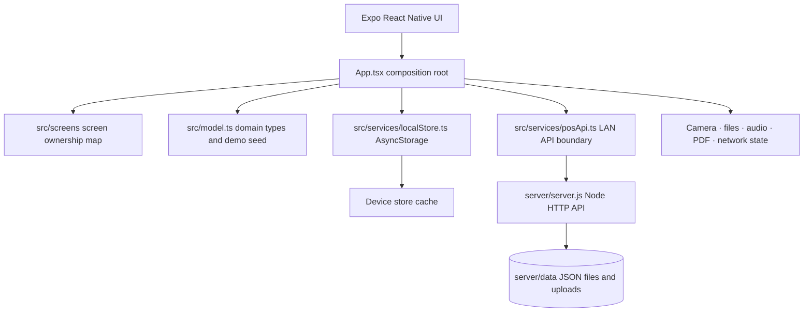

# Retail POS · React Native

An Expo-based point-of-sale app for Android and iOS. It brings checkout, inventory, staff operations and store reporting into one mobile workflow. The React Native app is maintained independently from the existing native Android application.

> **Project status:** feature-rich development app with a local-first store and an optional LAN Node.js sync service. The included server persists JSON files and is intended for local development/demo use; production deployments need a secured, multi-user database-backed API.

## At a glance

- Expo SDK 57 · React 19 · React Native 0.86 · TypeScript
- Offline-first store state using AsyncStorage; LAN sync and presence when the API is configured
- Separate device-network and POS-server health states, with a sync-status screen and retry queue
- Role-aware modules for administrators, managers, sales staff, inventory staff and cashiers
- USD/PKR display with a configurable exchange rate; values are stored in USD
- Product photos, profile photos, barcode scanning, PDF receipts and receipt evidence
- Staff messaging with text, image/file attachments and recorded voice notes

## Product capabilities

| Area | What the app supports |
| --- | --- |
| Sign-in & profiles | Username/password or PIN sign-in, account signup, role selection, password reset request flow, password/PIN setup, profile photo and personal details |
| Point of sale | Product search and category filters, barcode camera, customer selection, cart quantities, line/cart discounts, tax, cash/card/wallet/bank/split payment, change calculation and receipt |
| Products & stock | Add/edit/delete catalog items, product image, SKU/barcode, pricing/cost/tax, quantity adjustment, low/out-of-stock and expiry views |
| Customers & suppliers | Directory records with contact information, date of birth/age, address and photos; customer snapshots are kept with receipts |
| Purchases | Supplier purchase orders, pending/received state and receiving stock into inventory |
| Orders & evidence | Invoice history, refunds/restock, receipt share, PDF export and optional payment/receipt photo evidence |
| Reports & administration | Daily/weekly/monthly sales summaries, staff activity/audit trail, online/offline presence and role-based navigation |
| Team chat | Direct/group conversations, text, image/file attachments and voice messages, with optional API sync |
| Offers & currency | Built-in bundle offer suggestions; currency toggle between USD and PKR using a configurable rate |

Permissions are enforced in the application UI and navigation. A production service must enforce the same role permissions server-side; hiding a screen in a client is not an authorization boundary.

## Architecture



### State and data flow

1. On launch, the app loads the device's saved `Store` and currency settings. The bundled seed initializes a fresh install.
2. If `EXPO_PUBLIC_POS_API_URL` is set and the network is available, the app merges remote users and syncs queued activity, sales, presence and chat. An unavailable API does not prevent local use.
3. User actions update typed domain records in the app store. The store is saved locally, then eligible changes are sent to the optional API.
4. A completed checkout records a sale and stock movement, updates inventory/customer totals, writes audit/receipt evidence, clears the cart and opens the receipt sheet.
5. Product and profile media are copied into the app document directory. Chat files can be uploaded through the development server and are referenced by a server path.
6. Device network state and POS API health are checked separately. Pending sale, stock and sign-out events remain in the local queue until the server acknowledges their IDs; failed sync batches retry with bounded exponential backoff.

### Source map

```text
react-native-pos/
├── App.tsx                 # App composition, navigation state, workflows and shared sheets
├── src/
│   ├── model.ts            # Store/domain types, demo data, formatters and deal fixtures
│   ├── services/
│   │   ├── localStore.ts   # Offline store persistence boundary
│   │   └── posApi.ts       # Optional LAN API and media serialization boundary
│   └── screens/
│       ├── DashboardScreen.tsx
│       ├── RegisterScreen.tsx
│       ├── ProductsScreen.tsx
│       ├── InventoryScreen.tsx
│       ├── OrdersScreen.tsx
│       ├── PurchasesScreen.tsx
│       ├── CustomersScreen.tsx
│       ├── AIDealsScreen.tsx
│       ├── ReportsScreen.tsx
│       ├── AdminScreen.tsx
│       ├── StaffScreen.tsx
│       ├── ProfileScreen.tsx
│       ├── TeamChatScreen.tsx
│       ├── AuthScreen.tsx
│       ├── SyncStatusScreen.tsx
│       └── README.md       # Four developer workstreams and screen contracts
├── server/
│   ├── server.js           # Development HTTP API
│   └── README.md           # Backend setup and endpoint notes
└── assets/                 # App icon and splash artwork
```

`App.tsx` is the coordinator for navigation, durable state, domain actions and shared sheets. Dashboard, Register, AI Deals, Products, Inventory, Orders, Purchases, Customers, Reports, Admin, Staff, Profile, Team Chat and Authentication are extracted components with typed props. The remaining shared checkout/form/receipt overlays stay composed at the root because they span multiple screens. Place independently owned screens in `src/screens/<ScreenName>.tsx`, reusable presentation in `src/components/`, and domain calculations in `src/domain/`.

## Requirements and setup

- Node.js 20.19.4+ (use a currently supported LTS release), npm, and Expo Go or an Android emulator.
- For iOS simulator/device builds, use macOS with Xcode and the corresponding Expo workflow.

```bash
cd react-native-pos
npm install
npm start
```

From the Expo terminal, scan the QR code with Expo Go or press `a` for an Android emulator. Useful commands:

```bash
npm run android
npm run ios
npm run web
npm run server
```

The Metro/Expo address is assigned for the current machine/network session. Find it in the Expo terminal; do not hard-code a changing LAN IP into the app or README.

### Optional LAN backend

Run `npm run server` on a computer reachable from the phone. Set these values in an ignored `.env.local` file before starting Expo:

```dotenv
EXPO_PUBLIC_POS_API_URL=http://<computer-lan-ip>:8090
EXPO_PUBLIC_POS_API_KEY=<local-development-key>
```

Restart Expo after changing environment values. Keep the phone and server on a network that allows device-to-device traffic. Use `/health` to check server reachability. Backend details and routes are documented in [server/README.md](server/README.md).

Expo public environment variables are embedded in the client bundle. The API key above is only a development gate, never a production secret. Runtime store JSON/uploads, `.env.local`, and generated build folders are ignored by Git.

## Screen-based developer workflow

1. Read [src/screens/README.md](src/screens/README.md) and choose one screen/module owner.
2. Agree on the screen's typed props and callbacks before changing app-wide state or the domain model.
3. Keep screen-specific visual state local. Send durable store changes through composition-root callbacks/services.
4. Extract shared fields, buttons and list rows to `src/components/`; keep API and file-system code in `src/services/`.
5. Add a short comment where a workflow crosses boundaries (for example, checkout, offline sync, refunds or media upload). Explain the sequence and invariant, not each obvious line.
6. Update the screen ownership map and this documentation when responsibilities or API contracts change.

The current app uses one central store, so avoid simultaneous edits to `App.tsx` for unrelated screens. Extract a screen behind a prop contract first, then parallel screen work can proceed in separate files.

## Domain model and key invariants

- `Store` contains products, sales, purchases, customers, suppliers, users, movements, audits, notices, presence, sync events, password reset requests and chat messages.
- Sale line items keep a receipt-time name/SKU/price snapshot. Refunds restore quantities to stock and mark the original sale refunded rather than erasing the record.
- Sale/product amounts are stored as USD base values. PKR is a display/input conversion controlled by the configured exchange rate.
- Profile/product photo local URIs are device-local; they are not automatically portable across devices. Chat attachments use the optional backend upload path when synced.
- The local demo seed is suitable for trying flows, not a real business database. Protect real customer and staff data before deploying.

## Backend routes

The development service exposes `GET /health`, user sync and heartbeat/offline routes, chat message read/write and file serving, activity read/write, event sync, and sales read. The server checks the configured API key and stores runtime data under ignored `server/data/` files. See the backend README for specifics.

## Configuration and assets

- Expo app configuration: `app.json`
- Dependencies and Expo scripts: `package.json`
- TypeScript settings: `tsconfig.json`
- Android manifest (generated/native app): `app/src/main/AndroidManifest.xml`
- Ignore local keys, Expo credentials and runtime data. Never commit a real API key, customer dataset, signing key or production credentials.

## Checks before handing off

```bash
npx tsc --noEmit
npx expo export --platform android
node --check server/server.js
```

Record which checks were run and any environment-specific limitation in the task/PR summary. This repository does not currently define an automated test suite.
